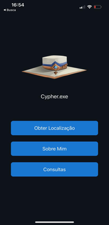

# 🌐Cypher
* 1° Trabalho da disciplina de Mobile do curso de ADS [Fatec Itu](https://fatecitu.edu.br/portal/cursos/analise-e-desenvolvimento-de-sistemas/)
* App React-Native/Expo de **Localização inspirado no personagem Cypher do jogo [Valorant](https://playvalorant.com/pt-br/?gclid=CjwKCAjw3POhBhBQEiwAqTCuBsSOqclOr-jiEPABjzKKJLVEawMnVLksGHC7X_DpnEhuTvlFAQPjURoCpNEQAvD_BwE&gclsrc=aw.ds)**

## :books: Informações Gerais
- React [useState hook](https://reactjs.org/docs/hooks-state.html) utilizado para receber os dados do SDK Location e da API ViaCep .
- Expo [SDK Location](https://docs.expo.dev/versions/latest/sdk/location/) - Pacote que permite a leitura de informações de geolocalização do dispositivo.
- API [ViaCep](https://viacep.com.br/)  realiza a consulta de CEPs de todo o Brasil.

## :camera: Capturas de Tela
   

## :signal_strength: Tecnologias

* [Expo v44](https://docs.expo.io/) - Framework e plataforma para aplicações React, instalada globalmente; 
* [React Native 0.71.4](https://reactnative.dev/) para criar o aplicativos nativos para Android e iOS;
* [React Native Web 0.18.11](https://www.npmjs.com/package/react-native-web) - Componentes e APIs para Web (Opcional);
* [Moti](https://moti.fyi) - Pacote de animação universal para React Native

## :floppy_disk: Setup

* Rode `npm i` ou `yarn` para instalar as dependências
* Execute `npm i -g expo-cli` para instalar o Expo CLI globalmente
* Rode `npx expo start` ou `expo start`  para iniciar a aplicação expo localmente

## :point_right: Integrantes
* [Lucas Henrique Pereira Alves e Silva](https://github.com/7Lucas)
